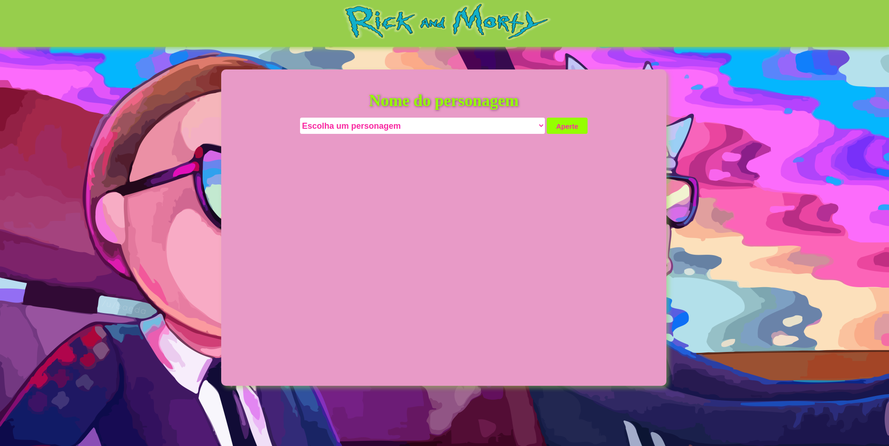

<h1 style="text-align: center;"> Rick And Morty Project </h1>
<h1 style="text-align: center;"></h1>

## Sobre

Um site onde você escolhe um personagem do seriado "Rick and Morty" e é retornado a foto desse personagem, o nome e a sua espécie. Foi utilizado a "The Rick and Morty API" no projeto.

## Tecnologias Utilizadas

- HTML
- CSS
- SASS
- Javascript
- Axios

## API'S Utilizadas

- The Rick and Morty API
